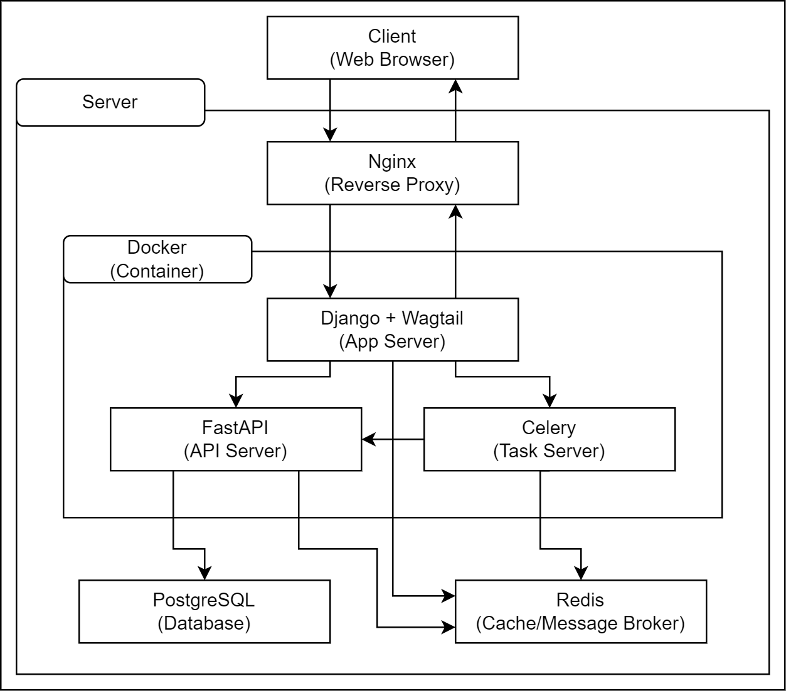
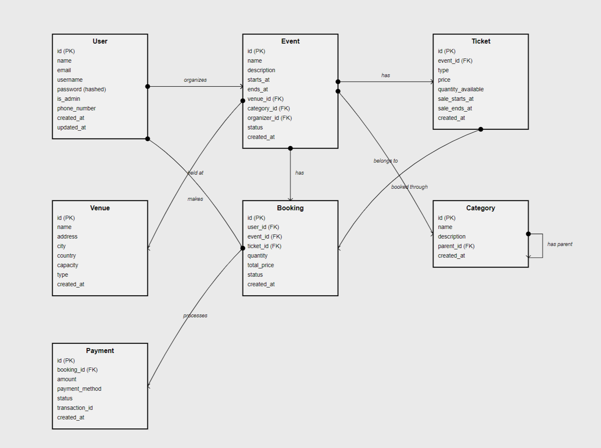

# **Event Management System**
A robust event management application built with modern architecture for extensibility and scale.

## **Description**
This EMS application is built for robustness and speed, the design is meant to make it extensible and scalable.  

Events can be created by admins and attendees can book to attend numerous events.  

The approach here is an API-first approach to allow for various clients.  

The framework and tools utilized are diverse, such as:
- [FastAPI](https://fastapi.tiangolo.com/)
- [PostgreSQL](https://www.postgresql.org/download/)
- [Redis](https://redis.io/docs/latest/operate/oss_and_stack/install/install-redis/)
- [MongoDB](https://www.mongodb.com/try/download/community)
- [Celery](https://docs.celeryq.dev/en/main/getting-started/introduction.html)
- [RabbitMQ](https://www.rabbitmq.com/tutorials)
- [SQLAlchemy](https://docs.sqlalchemy.org/en/20/)
- [Alembic](https://alembic.sqlalchemy.org/en/latest/)
- [Pytest](https://docs.pytest.org/en/stable/getting-started.html)
- [Docker](https://docs.docker.com/engine/install/)

### Table of Contents
- [Structure](#Structure)
- [Schema](#Schema)
- [Setup](#Setup)
- [License](#License)
- [Contact](#Contact)

## **Structure**
This is a high level overview of the project. 



## **Schema**
This is an overview of the database layout.  



## **Setup**
Knowledge of the prerequisites below is vital for running this application locally.  
Make sure docker is properly installed and running to avoid errors.

### Prerequisites
- [Python 3.9+](https://www.python.org/downloads/)
- [PostgreSQL](https://www.postgresql.org/download/)
- [Celery](https://docs.celeryq.dev/en/main/getting-started/introduction.html)
- [Redis](https://redis.io/docs/latest/operate/oss_and_stack/install/install-redis/)
- [Docker](https://docs.docker.com/engine/install/)
- [MongoDB](https://www.mongodb.com/try/download/community)

### Steps
- Clone the repository
   ```bash
      git clone https://github.com/amunipelumi/ems-project  
   ```

- Change directory
   ```bash
      cd ems-project  
   ``` 

- Setup `.env`
    - `POSTGRES_USER`: Set a username for PostgreSQL
    - `POSTGRES_PASSWORD`: Set a password for PostgreSQL
    - `POSTGRES_DB`: Set the database name
    - `REDIS_PASSWORD`: Set password for Redis server
    - `RABBITMQ_DEFAULT_USER`: Set default user for RabbitMQ
    - `RABBITMQ_DEFAULT_PASS`: Set password for RabbitMQ
    - `MONGO_INITDB_ROOT_USERNAME`: Set username for MongoDB
    - `MONGO_INITDB_ROOT_PASSWORD`: Set MongoDB password
    - `TEST_MODE`: Set this to `False`
    - `SECRET_KEY`: You can use `openssl rand -hex 16` to generate one
    - `ALGORITHM`: Set your algorithm of choice, preferably `HS256`
    - `EXPIRE_MIN`: Integer value of minutes for JWT token
    - `EXPIRE_DAYS`: Integer value of days for refresh token
    - `DB_HOSTNAME`: Set to service name e.g `postgres`
    - `DB_USERNAME`: Same as `POSTGRES_USER` above
    - `DB_PASS`: Same as `POSTGRES_PASSWORD` above
    - `DB_PORT`: Same as default port used in service
    - `DB_NAME`: Same as `POSTGRES_DB` above
    - `REDIS_PASS`: Same as `REDIS_PASSWORD` above
    - `REDIS_HOST`: Same as service name, set to `redis`
    - `REDIS_PORT`: Same as default port used in service
    - `REDIS_DB`: Integer of redis database of choice, can be `0, 1, ...16`
    - `RMQ_USERNAME`: Same as `RABBITMQ_DEFAULT_USER` above
    - `RMQ_PASSWORD`: Same as `RABBITMQ_DEFAULT_PASS` above
    - `RMQ_ADDRESS`: Same as service name, set to `rabbitmq`
    - `RMQ_PORT`: Same as default port used in service
    - `MDB_HOST`: Same as service name, set to `mongodb`
    - `MDB_PORT`: Same as default port used in service
    - `MDB_NAME`: Set to any name of choice
    - `MDB_COLL`: Set to any name of choice

- Run application
      ```bash
         docker-compose up -d
      ```

## **License**
This project is licensed under the MIT License.  
See the [LICENSE](LICENSE) file for details.

## **Contact**
- Name: Amuni Pelumi
- Email: [Amuni Pelumi](mailto:work.amuni@gmail.com)
- LinkedIn: [Amuni Pelumi](https://www.linkedin.com/in/amunipelumi/)
- X fka Twitter: [Amuni Pelumi](https://x.com/amunipelumi)
